## CAN

### 20世纪80年代初德国Bosch公司为解决现代汽⻋中众多控制单元、测试仪器之间的实时数据交换⽽开发的⼀种串⾏通信协议

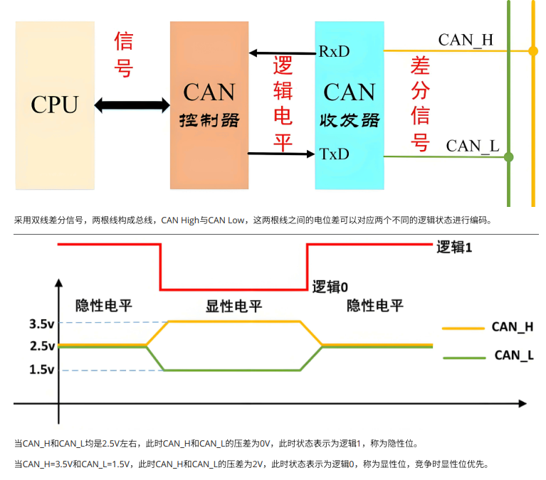

| 波特率    | 总线长度 |
| --------- | -------- |
| 1Mbit/s   | 25m      |
| 500Kbit/s | 100m     |
| 250Kbit/s | 250m     |
| 125Kbit/s | 500m     |
| 50Kbit/s  | 1km      |
| 20Kbit/s  | 2.5km    |
| 10Kbit/s  | 5km      |
| 5Kbit/s   | 13km     |

### 数据格式

- ⽹络上任何⼀个节点在任何时候都可以发送数据
- 多个节点发送数据，优先级低主动退出发送
- 短帧结构，每帧数据信息为0~8字节（具体⽤⼾定义），对数据编码⽽不是地址编码
- CAN每帧都有CRC校验和其他检验措施，严重错误的情况下具有⾃动关闭输出的功能

1. 数据帧
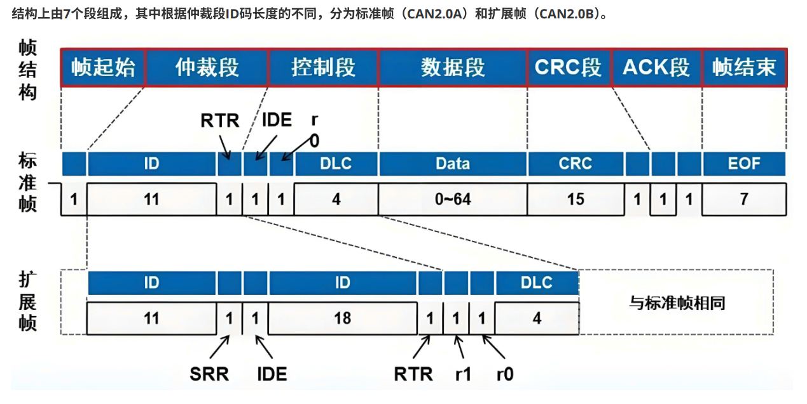

2. 帧起始、帧结束
- 1个位的低电平表⽰帧的开始
- 7个位的⾼电平表⽰帧的结束
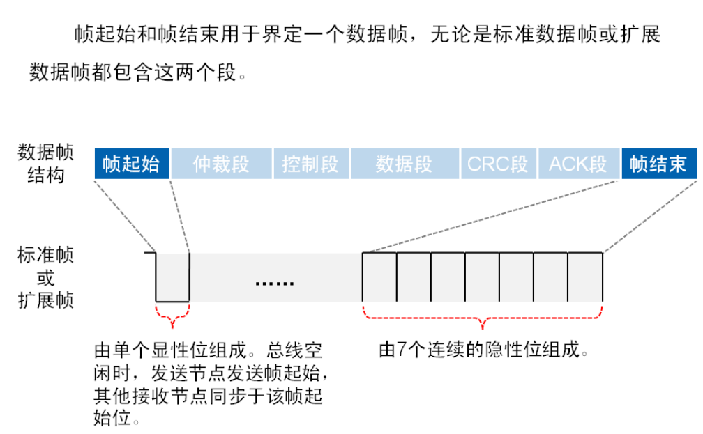

3. 仲裁段
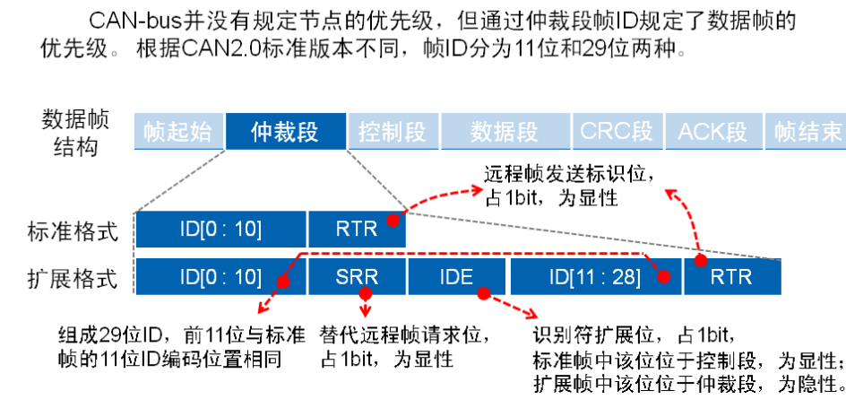

4. 显性隐性
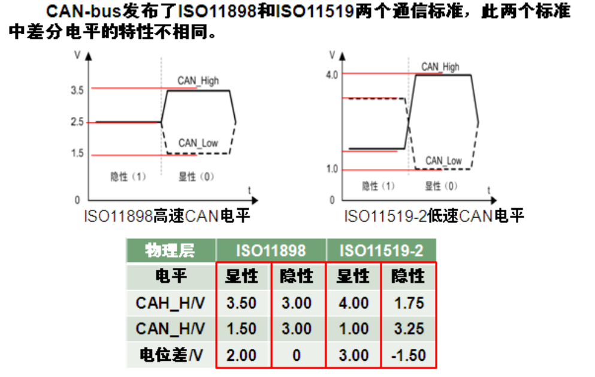

5. 总线仲裁
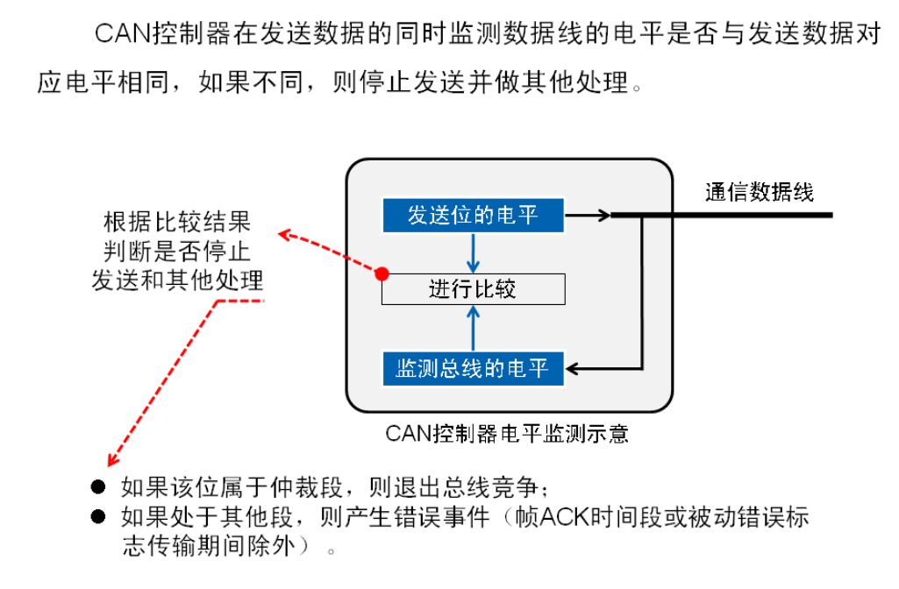
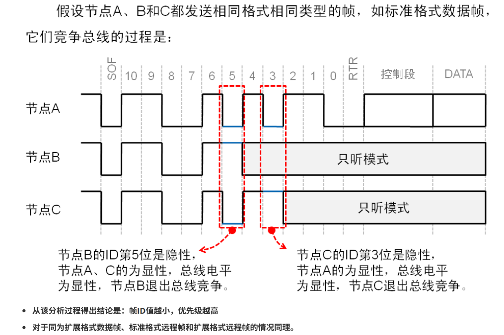
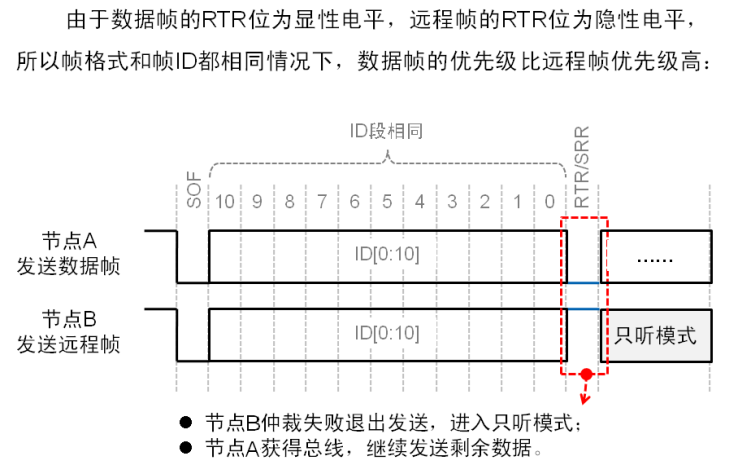
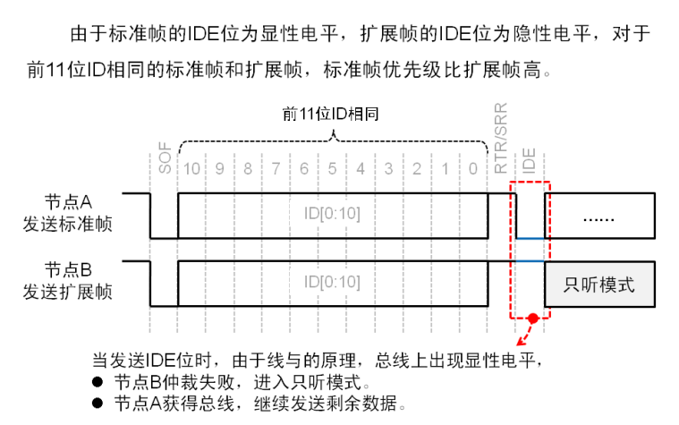
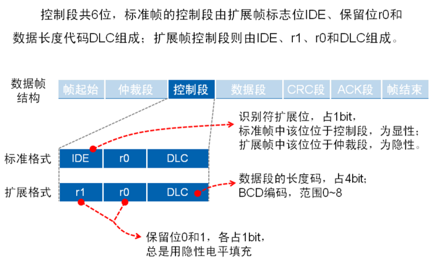

6. 数据段
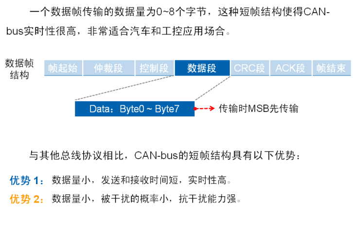

7. CRC段
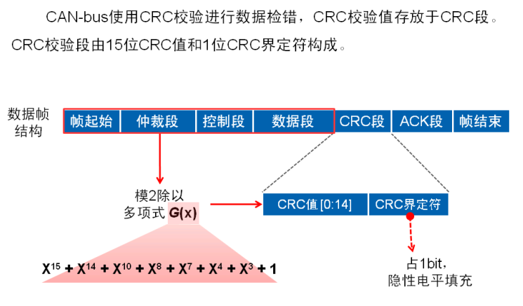

8. ACK段
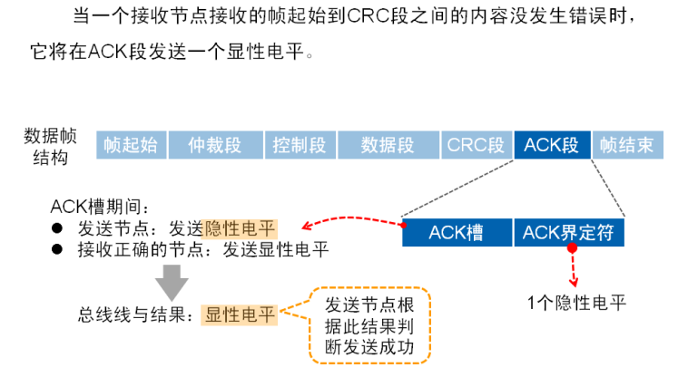

9. 远程帧
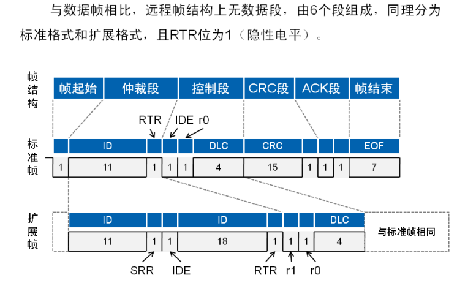
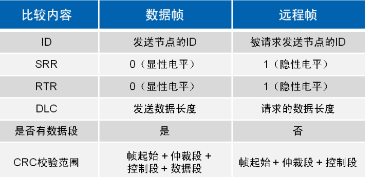

10. CAN-bus 错误类型
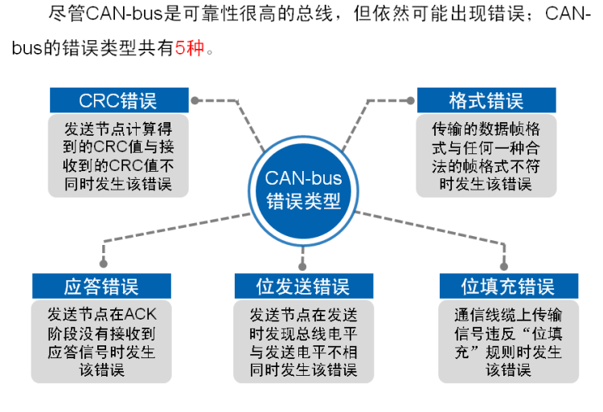
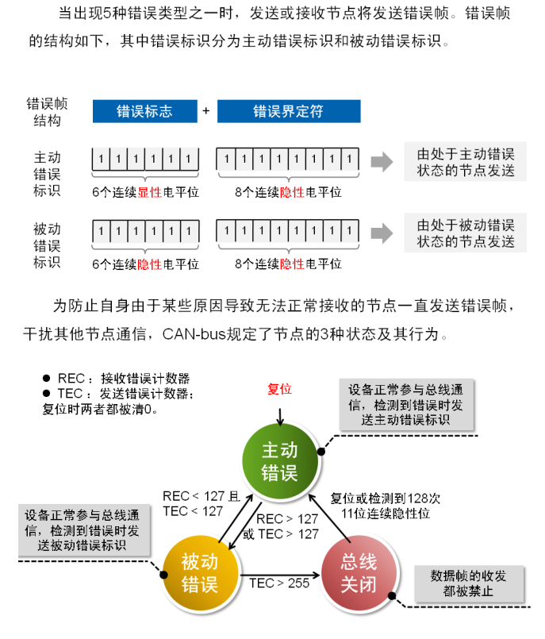

11. 过载帧
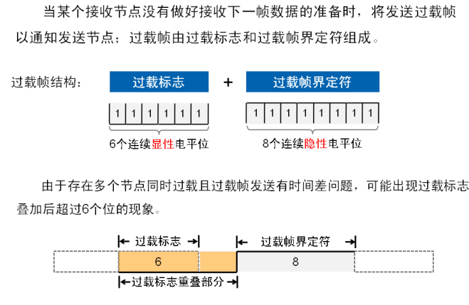

12. 帧间隔
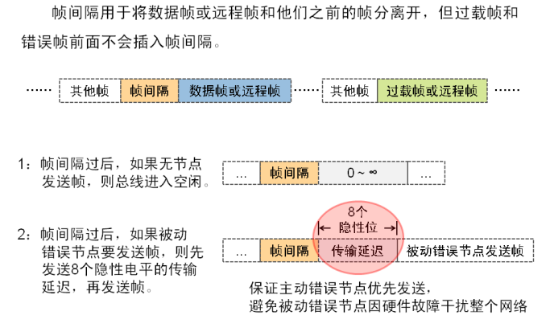
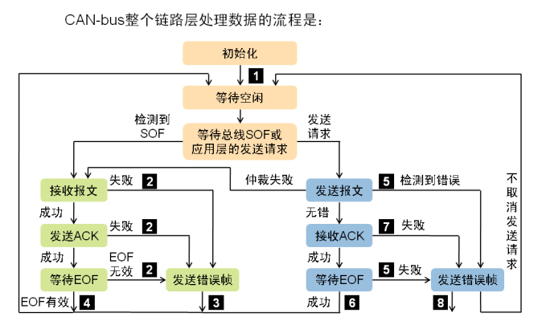

### CANopen

#### CANopen协议，是20 世纪 90 年代末，由CiA 协会在 CAL（CAN Application Layer）的基础上制定的⼀种架构在控制器局域⽹络（Controller Area Network, CAN）上的⾼层通讯协议标准。CANopen协议制定了相当于 OSI 模型 中第五层（会话层）、第六层（表⽰层）和第七层（应⽤层）的技术规范。CAL提供了所有的⽹络管理服务和报⽂传送协议，但并没有定义通讯对象的内容或者正在通讯的对象的类型（它只定义了how，没有定义what）。⽽这正是CANopen切⼊点。CANopen是在CAL基础上开发的，使⽤CAL通讯和服务协议⼦集，提供了分布式控制系统的⼀种实现⽅案。CANopen协议是免许可证的，任何组织和个⼈都可以开发⽀持CANopen协议的设备⽽不⽤⽀付版税。
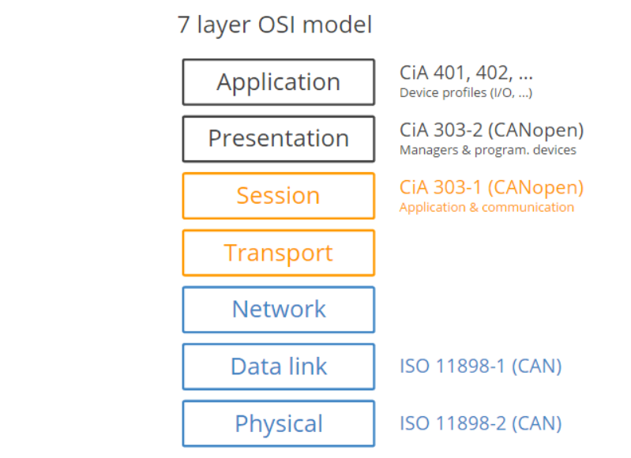

#### CANopen对象字典

##### 对象字典就是⼀个有序的对象组，描述了对应CANopen节点的所有参数
###### 每个对象采⽤⼀个16位的索引值来寻址，这个索引值通常被称为索引，其范围在0x0000到0xFFFF之间。为了避免数据⼤量时⽆索引可分配，在某些索引下定义了⼀个8 位的索引值，这个索引值通常被称为⼦索引，其范围是0x00到0xFF之间。每个索引内具体的参数，最⼤⽤32位的变量来表⽰，即Unsigned32，四个字节

| Index range索引范围 | Description描述                                      |
| ------------------- | ---------------------------------------------------- |
| 0000h               | Reserved保留                                         |
| 0001h to 025Fh      | Data types数据类型                                   |
| 0260h to 0FFFh      | Reserved保留                                         |
| 1000h to 1FFFh      | Communication profile area通讯对象⼦协议区           |
| 2000h to 5FFFh      | Manufacturer-specific profile area制造商特定⼦协议区 |
| 6000h to 9FFFh      | Standardized profile area标准化设备⼦协议区          |
| A000h to AFFFh      | Network variables⽹络变量（符合IEC61131-3）          |
| B000h to BFFFh      | System variables⽤于路由⽹关的系统变量               |
| C000h to FFFFh      | Reserved保留                                         |

- 通讯对象⼦协议区(Communication profile area)定义了所有和通信有关的对象参数，索引范围1000h to 1029h为通⽤通讯对象，所有CANopen节点都必须具备这些索引，否则将⽆法加⼊CANopen⽹络
  | Index range索引范围 | Description描述                           |
  | ------------------- | ----------------------------------------- |
  | 1000h to 1029h      | General communication objects通⽤通讯对象 |
  | 1200h to 12FFh      | SDO parameter objects SDO参数对象         |
  | 1300h to 13FFh      | CANopen safety objects 安全对象           |
  | 1400h to 1BFFh      | PDO parameter objects PDO参数对象         |
  | 1F00h to 1F11h      | SDO manager objects SDO管理对象           |
  | 1F20h to 1F27h      | Configuration manager objects配置管理对象 |
  | 1F50h to 1F54h      | Program control object程序控制对象        |
  | 1F80h to 1F89h      | NMT master objects⽹络管理主机对象        |

- ⽤通讯对象(General communication objects)，由于通⽤通讯对象⼗分重要，NMT主站(CANopen主站)在启动时，通常都全部或者部分读取所有从站中通⽤通讯对象中的索引，所以所有的通⽤通讯对象都必须在CANopen从站中实现，使⽤者也必须熟知这些索引地址与其含义

  | Index索引 | Object对象 | Name名字                                             |
  | --------- | ---------- | ---------------------------------------------------- |
  | 1000h     | VAR变量    | Device type设备类型                                  |
  | 1001h     | VAR变量    | Error register错误寄存器                             |
  | 1002h     | VAR变量    | Manufacturer status register制造商状态寄存器         |
  | 1003h     | ARRAY数组  | Pre-defined error field预定义错误场                  |
  | 1005h     | VAR变量    | COB-ID Sync message同步报⽂COB标识符                 |
  | 1006h     | VAR变量    | Communication cycle period同步通信循环周期（单位us） |
  | 1007h     | VAR变量    | Synchronous windows length同步窗⼝⻓度(单位us)       |
  | 1008h     | VAR变量    | Manufacturer device name制造商设备名称               |
  | 1009h     | VAR变量    | Manufacturer hardware version制造商硬件版本          |
  | 100Ah     | VAR变量    | Manufacturer software version制造商软件版本          |
  | 100Ch     | VAR变量    | Guard time守护时间（单位ms                           |
  | 100Dh     | VAR变量    | Life time factor寿命因⼦（单位ms）                   |
  | 1010h     | VAR变量    | Store parameters保存参数                             |
  | 1011h     | VAR变量    | Restore default parameters恢复默认参数               |
  | 1012h     | VAR变量    | COB-ID time stamp时间报⽂COB标识符（发送⽹络时间）   |
  | 1013h     | VAR变量    | High resolution time stamp⾼分辨率时间标识           |
  | 1014h     | VAR变量    | COB-ID emergency紧急报⽂COB标识符                    |
  | 1015h     | VAR变量    | Inhibit time emergency紧急报⽂禁⽌时间（单位100us    |
  | 1016h     | ARRAY数组  | Consumer heartbeat time消费者⼼跳时间间隔(单位ms)    |
  | 1017h     | VAR变量    | Producer heartbeat time⽣产者⼼跳时间间隔（单位ms）  |
  | 1018h     | RECORD记录 | Identity object⼚商ID标识对象                        |
  | 1019h     | VAR变量    | Sync.counter overflow value同步计数溢出值            |
  | 1020h     | ARRAY数组  | Verify configuration验证配置                         |
  | 1021h     | VAR变量    | Store EDS存储EDS                                     |
  | 1022h     | VAR变量    | Storage format存储格式                               |
  | 1023h     | RECORD记录 | OS command操作系统命令                               |
  | 1024h     | VAR变量    | OS command mode操作系统命令模式                      |
  | 1025h     | RECORD记录 | OS debugger interface操作系统调试接⼝                |
  | 1026h     | ARRAY数组  | OS prompt操作系统提⽰                                |
  | 1027h     | ARRAY数组  | Module list模块列表                                  |
  | 1028h     | ARRAY数组  | Emergency consumer紧急报⽂消费者                     |
  | 1029h     | ARRAY数组  | Error behavior错误⾏为                               |

- ARRAY数组制造商特定⼦协议  

  | Index range索引范围 | Description描述                                      |
  | ------------------- | ---------------------------------------------------- |
  | 0000h               | Reserved保留                                         |
  | 0001h to 025Fh      | Data types数据类型                                   |
  | 0260h to 0FFFh      | Reserved保留                                         |
  | 1000h to 1FFFh      | Communication profile area通讯对象⼦协议区           |
  | 2000h to 5FFFh      | Manufacturer-specific profile area制造商特定⼦协议区 |
  | 6000h to 9FFFh      | Standardized profile area标准化设备⼦协议区          |
  | A000h to AFFFh      | Network variables⽹络变量（符合IEC61131-3）          |
  | B000h to BFFFh      | System variables⽤于路由⽹关的系统变量               |
  | C000h to FFFFh      | Reserved保留                                         |

- 标准化设备⼦协议
  - 数字量和模拟量输⼊/输出模块(DS401)
  - 电机(DS402)
  - 控制设备(DS4P403)闭环控制器(DSP404)
  - PLC(DS405) (CANopen 和 IEC61131)的全部功能
  - 编码器(DS406)

