## CAN

### 20世纪80年代初德国Bosch公司为解决现代汽⻋中众多控制单元、测试仪器之间的实时数据交换⽽开发的⼀种串⾏通信协议


| 波特率    | 总线长度 |
| --------- | -------- |
| 1Mbit/s   | 25m      |
| 500Kbit/s | 100m     |
| 250Kbit/s | 250m     |
| 125Kbit/s | 500m     |
| 50Kbit/s  | 1km      |
| 20Kbit/s  | 2.5km    |
| 10Kbit/s  | 5km      |
| 5Kbit/s   | 13km     |

### 数据格式

- ⽹络上任何⼀个节点在任何时候都可以发送数据
- 多个节点发送数据，优先级低主动退出发送
- 短帧结构，每帧数据信息为0~8字节（具体⽤⼾定义），对数据编码⽽不是地址编码
- CAN每帧都有CRC校验和其他检验措施，严重错误的情况下具有⾃动关闭输出的功能

1. 数据帧


2. 帧起始、帧结束
- 1个位的低电平表⽰帧的开始
- 7个位的⾼电平表⽰帧的结束


3. 仲裁段


4. 显性隐性


5. 总线仲裁


6. 数据段


7. CRC段


8. ACK段


9. 远程帧


10. CAN-bus 错误类型


11. 过载帧


12. 帧间隔


### CANopen

#### CANopen协议，是20 世纪 90 年代末，由CiA 协会在 CAL（CAN Application Layer）的基础上制定的⼀种架构在控制器局域⽹络（Controller Area Network, CAN）上的⾼层通讯协议标准。CANopen协议制定了相当于 OSI 模型 中第五层（会话层）、第六层（表⽰层）和第七层（应⽤层）的技术规范。CAL提供了所有的⽹络管理服务和报⽂传送协议，但并没有定义通讯对象的内容或者正在通讯的对象的类型（它只定义了how，没有定义what）。⽽这正是CANopen切⼊点。CANopen是在CAL基础上开发的，使⽤CAL通讯和服务协议⼦集，提供了分布式控制系统的⼀种实现⽅案。CANopen协议是免许可证的，任何组织和个⼈都可以开发⽀持CANopen协议的设备⽽不⽤⽀付版税。


#### CANopen对象字典

##### 对象字典就是⼀个有序的对象组，描述了对应CANopen节点的所有参数
###### 每个对象采⽤⼀个16位的索引值来寻址，这个索引值通常被称为索引，其范围在0x0000到0xFFFF之间。为了避免数据⼤量时⽆索引可分配，在某些索引下定义了⼀个8 位的索引值，这个索引值通常被称为⼦索引，其范围是0x00到0xFF之间。每个索引内具体的参数，最⼤⽤32位的变量来表⽰，即Unsigned32，四个字节

| Index range索引范围 | Description描述                                      |
| ------------------- | ---------------------------------------------------- |
| 0000h               | Reserved保留                                         |
| 0001h to 025Fh      | Data types数据类型                                   |
| 0260h to 0FFFh      | Reserved保留                                         |
| 1000h to 1FFFh      | Communication profile area通讯对象⼦协议区           |
| 2000h to 5FFFh      | Manufacturer-specific profile area制造商特定⼦协议区 |
| 6000h to 9FFFh      | Standardized profile area标准化设备⼦协议区          |
| A000h to AFFFh      | Network variables⽹络变量（符合IEC61131-3）          |
| B000h to BFFFh      | System variables⽤于路由⽹关的系统变量               |
| C000h to FFFFh      | Reserved保留                                         |

- 通讯对象⼦协议区(Communication profile area)定义了所有和通信有关的对象参数，索引范围1000h to 1029h为通⽤通讯对象，所有CANopen节点都必须具备这些索引，否则将⽆法加⼊CANopen⽹络
  | Index range索引范围 | Description描述                           |
  | ------------------- | ----------------------------------------- |
  | 1000h to 1029h      | General communication objects通⽤通讯对象 |
  | 1200h to 12FFh      | SDO parameter objects SDO参数对象         |
  | 1300h to 13FFh      | CANopen safety objects 安全对象           |
  | 1400h to 1BFFh      | PDO parameter objects PDO参数对象         |
  | 1F00h to 1F11h      | SDO manager objects SDO管理对象           |
  | 1F20h to 1F27h      | Configuration manager objects配置管理对象 |
  | 1F50h to 1F54h      | Program control object程序控制对象        |
  | 1F80h to 1F89h      | NMT master objects⽹络管理主机对象        |

- ⽤通讯对象(General communication objects)，由于通⽤通讯对象⼗分重要，NMT主站(CANopen主站)在启动时，通常都全部或者部分读取所有从站中通⽤通讯对象中的索引，所以所有的通⽤通讯对象都必须在CANopen从站中实现，使⽤者也必须熟知这些索引地址与其含义

  | Index索引 | Object对象 | Name名字                                             |
  | --------- | ---------- | ---------------------------------------------------- |
  | 1000h     | VAR变量    | Device type设备类型                                  |
  | 1001h     | VAR变量    | Error register错误寄存器                             |
  | 1002h     | VAR变量    | Manufacturer status register制造商状态寄存器         |
  | 1003h     | ARRAY数组  | Pre-defined error field预定义错误场                  |
  | 1005h     | VAR变量    | COB-ID Sync message同步报⽂COB标识符                 |
  | 1006h     | VAR变量    | Communication cycle period同步通信循环周期（单位us） |
  | 1007h     | VAR变量    | Synchronous windows length同步窗⼝⻓度(单位us)       |
  | 1008h     | VAR变量    | Manufacturer device name制造商设备名称               |
  | 1009h     | VAR变量    | Manufacturer hardware version制造商硬件版本          |
  | 100Ah     | VAR变量    | Manufacturer software version制造商软件版本          |
  | 100Ch     | VAR变量    | Guard time守护时间（单位ms                           |
  | 100Dh     | VAR变量    | Life time factor寿命因⼦（单位ms）                   |
  | 1010h     | VAR变量    | Store parameters保存参数                             |
  | 1011h     | VAR变量    | Restore default parameters恢复默认参数               |
  | 1012h     | VAR变量    | COB-ID time stamp时间报⽂COB标识符（发送⽹络时间）   |
  | 1013h     | VAR变量    | High resolution time stamp⾼分辨率时间标识           |
  | 1014h     | VAR变量    | COB-ID emergency紧急报⽂COB标识符                    |
  | 1015h     | VAR变量    | Inhibit time emergency紧急报⽂禁⽌时间（单位100us    |
  | 1016h     | ARRAY数组  | Consumer heartbeat time消费者⼼跳时间间隔(单位ms)    |
  | 1017h     | VAR变量    | Producer heartbeat time⽣产者⼼跳时间间隔（单位ms）  |
  | 1018h     | RECORD记录 | Identity object⼚商ID标识对象                        |
  | 1019h     | VAR变量    | Sync.counter overflow value同步计数溢出值            |
  | 1020h     | ARRAY数组  | Verify configuration验证配置                         |
  | 1021h     | VAR变量    | Store EDS存储EDS                                     |
  | 1022h     | VAR变量    | Storage format存储格式                               |
  | 1023h     | RECORD记录 | OS command操作系统命令                               |
  | 1024h     | VAR变量    | OS command mode操作系统命令模式                      |
  | 1025h     | RECORD记录 | OS debugger interface操作系统调试接⼝                |
  | 1026h     | ARRAY数组  | OS prompt操作系统提⽰                                |
  | 1027h     | ARRAY数组  | Module list模块列表                                  |
  | 1028h     | ARRAY数组  | Emergency consumer紧急报⽂消费者                     |
  | 1029h     | ARRAY数组  | Error behavior错误⾏为                               |

- ARRAY数组制造商特定⼦协议  

  | Index range索引范围 | Description描述                                      |
  | ------------------- | ---------------------------------------------------- |
  | 0000h               | Reserved保留                                         |
  | 0001h to 025Fh      | Data types数据类型                                   |
  | 0260h to 0FFFh      | Reserved保留                                         |
  | 1000h to 1FFFh      | Communication profile area通讯对象⼦协议区           |
  | 2000h to 5FFFh      | Manufacturer-specific profile area制造商特定⼦协议区 |
  | 6000h to 9FFFh      | Standardized profile area标准化设备⼦协议区          |
  | A000h to AFFFh      | Network variables⽹络变量（符合IEC61131-3）          |
  | B000h to BFFFh      | System variables⽤于路由⽹关的系统变量               |
  | C000h to FFFFh      | Reserved保留                                         |

- 标准化设备⼦协议
  - 数字量和模拟量输⼊/输出模块(DS401)
  - 电机(DS402)
  - 控制设备(DS4P403)闭环控制器(DSP404)
  - PLC(DS405) (CANopen 和 IEC61131)的全部功能
  - 编码器(DS406)

#### CANopen概念

1. CANopen通讯标识符
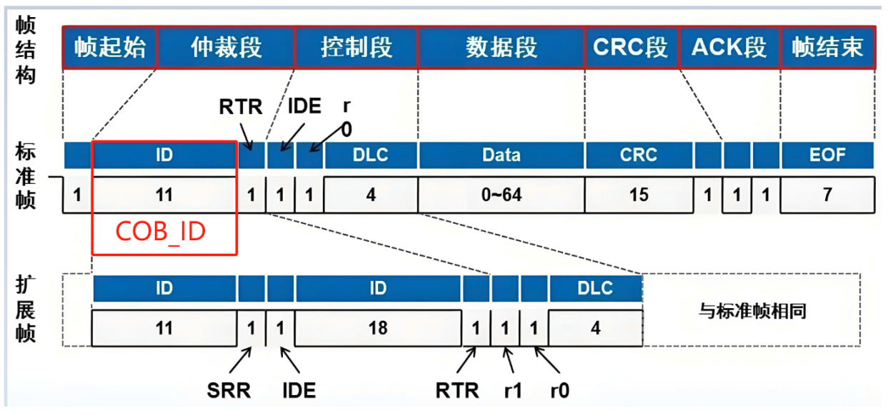
COB_ID位于上图的ID位置， 是11位的ID码。Communication Object Identifier (COB_ID)即通讯标识符。每个CANopen帧都以COB-ID开头，COB-ID是数据帧的唯⼀标识符。COB_ID包括功能段（FUNCTION）和地址段（NODE-ID)。Node-ID由设备⼚家定义，例如通过拨码开关设置。Node-ID范围是1~127（0不允许被使⽤）。COB_ID越⼩报⽂优先级别越⾼，CANopen的COB_ID范围从0-77F
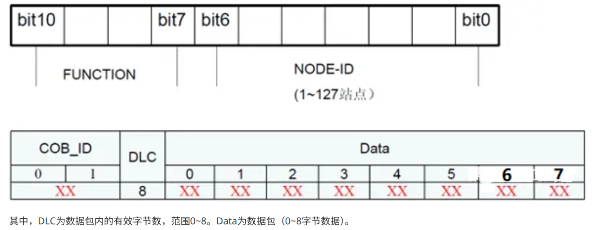

2. ⽹络管理对象（NMT）
⽹络管理对象-Network Management Objects（NMT）NMT到底是什么，简单理解就是由⼀台主机来管理从机，主机可以控制从机的状态。通过NMT对象执⾏NMT服务，通过NMT服务，可以初始化、启动、监控或复位CAN设备节点 NMT遵循主从结构
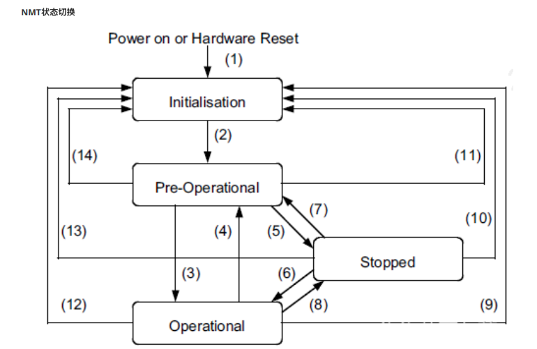
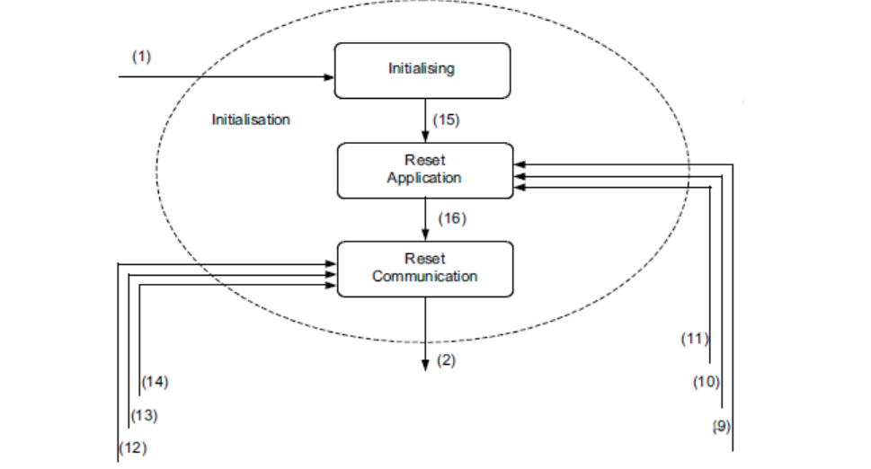
- a）NMT初始态，⼜分为三个⼦状态，分别为Initialising（初始化）、Reset application（复位应⽤）和Reset communication（复位通信）。初始化状态为设备上电或者硬件复位后的第⼀个状态，执⾏基本的canopen初始化后⾃动进⼊复位应⽤状态；
  - 在复位应⽤状态下，标准设备协议区参数和制造商特定协议区参数被赋予初值，之后进⼊复位通信状态；
  - 在复位通信状态下，通信参数区被赋予初值，然后canopen设备发送boot-up消息并进⼊预操作状态。
- b）NMT预操作状态，在预操作状态，允许SDO通信，禁⽌PDO通信，此状态通常⽤于配置PDO的通信参数和映射参数等，然后设备可以由NMT启动远程节点服务或本地控制进⼊运⾏状态。
- c）NMT运⾏态，此状态允许所有的通信服务
- d）NMT停⽌态，此状态下所有的通信服务被终⽌，包含EMCY也被挂起（除⼼跳和节点保护，如果被激活）

| 命令字 | 说明           |
| ------ | -------------- |
| 0x01   | 启动远程节点   |
| 0x02   | 停⽌远程节点   |
| 0x80   | 进⼊预操作状态 |
| 0x81   | 复位节点       |
| 0x82   | 复位节点通信   |

- NMT boot-up 上线报⽂任何⼀个canopen从设备上线后，为了提⽰主站已经加⼊⽹络（便于热插拔）。这个从站必须发出节点上线报⽂（boot-up）。报⽂格式如下，COB-ID为0x700+nodeID，数据⻓度为1个字节且数据为0
- NMT错误控制 NMT⽹络监控主要⽤于检测⽹络中的设备是否在线和设备所处的状态，包含节点保护和⼼跳，两者不能同时使⽤。
- 节点保护 节点保护是NMT主机通过远程帧，周期的查询⽹络中从机的状态。节点保护遵循主从模型，每个远程帧都必须得到应答。与节点保护相关的对象包含保护时间（单位ms）100Ch和寿命因⼦100Dh，100Ch和100Dh的乘积决定了主机查询的最迟时间
- ⼼跳⼼跳模式采⽤的⽣产者-消费者模型。CANOPEN设备可根据⽣产者⼼跳间隔对象1017h设置的周期来发送⼼跳报⽂，⼀旦在消费者⼼跳时间范围内未接受到相应节点的⽣产者⼼跳，则认为该节点故障

3. CANOpen通信⽅式

- SDO使⽤客⼾端服务器模式 ⽤来传输⾮实时数据，类似于I2C协议通信、Modbus协议通信， 采⽤问答式通信
- PDO采⽤⽣产者消费者模式 ⽤来传输实时数据，PDO 属于过程数据，即单向传输，⽆需接收节点回应报⽂来确认，属于⽣产消费模型
- 整个CANopen采⽤主从⽅式通信
  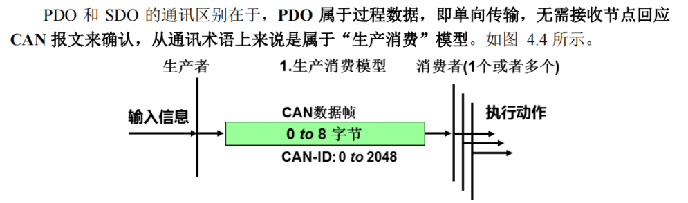
  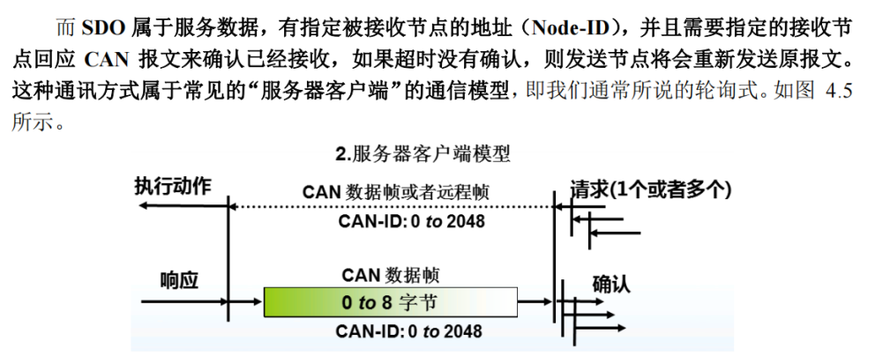
  - SDO: 适⽤于配置和详细的数据访问，需要通过明确的请求和应答进⾏交互。就像在图书馆系统中逐⼀操作书籍的借阅和归还
  - PDO: 适⽤于实时数据传输，⾃动化且周期性地传输数据。就像在⽣产线上实时监控数据，以便即时处理和响应

4. 服务数据对象（SDO）
SDO(Service Data Object)服务数据对象，⽤来传输⾮时间关键数据。服务确认是 SDO 的最⼤的特点，为每个消息都⽣成⼀个应答，确保数据传输的准确性。
SDO 属于服务数据，有指定被接收节点的地址（Node-ID），并且需要指定的接收节点回应 CAN 报⽂来确认已经接收，如果超时没有确认，则发送节点将会重新发送原报⽂。
这种通讯⽅式属于常⻅的“服务器客⼾端”的通信模型，即我们通常所说的轮询式或问答式
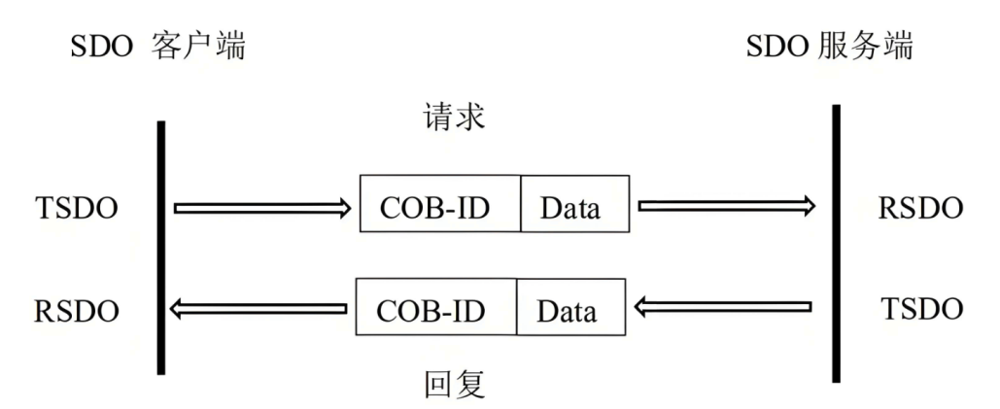
- 快速SDO⽤于读写不⼤于四个字节的数据，⼀次交互就搞定
- 普通SDO当传输的数据超过四字节时，就不能使⽤快速SDO传输，必须使⽤普通SDO进⾏传输，这种应⽤在实际中很少,⽐较繁琐⽽且使⽤普通SDO读写数据实⽤性也不太强

5. 过程数据对象（PDO）
PDO(Process Data Object)过程数据对象，8字节全部⽤来传输实时数据，提供对设备应⽤对象的直接访问通道，它⽤来传输实时短帧数据，具有较⾼的优先权。
PDO 传输的数据必须少于或等于 8 个字节，PDO 的 CAN 报⽂数据域中每个字节都⽤作数据传输，因此，在应⽤层上不包含传输控制信息，报⽂利⽤率极⾼。
PDO通信是基于⽣产者/消费者的通讯模式，如图所⽰，每个 PDO 有⼀个唯⼀的标识符且可以通过⼀个节点发送，但有多个节点可以接收。由⽣产者发送的 PDO称为发送 PDO(TPDO)，同样消费者接收的 PDO 称为接收 PDO(即 RPDO)，PDO 的接收不需要消费者的确认。
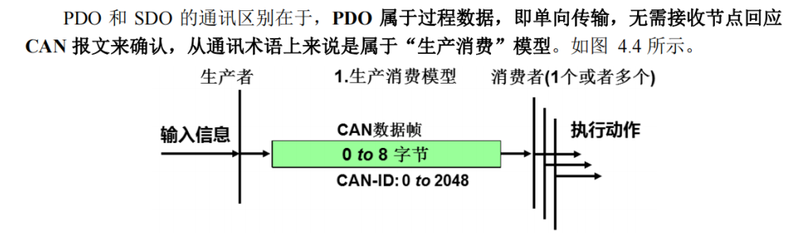
- PDO对象按照接收和发送的不同，PDO可分为RPDO和TPDO。PDO由通信参数和映射参数共同决定最终传输的⽅式及内容。
⼀般设备可能默认使⽤4个RPDO和4个TPDO来实现PDO的传输
- PDO的通信参数，定义了该pdo使⽤的COB-ID，传输类型、定时周期等
  - RPDO通讯参数位于对象字典索引的1400h to 15FFh区间
  - TPDO通讯参数位于对象字典索引的1800h to 19FFh区间
- PDO映射参数 每个PDO数据⻓度最多可达8个字节，可同时映射⼀个或多个对象。PDO的映射参数就是指该条PDO（RPDO或TPDO）所包含的对象的个数及每个对象的索引、⼦索引及映射对象⻓度信息

6. 同步对象（SYNC）
同步对象（SYNC）是控制多个节点发送与接收之间协调和同步的⼀种特殊机制，⽤于PDO的同步传输。
同步对象的传输遵循⽣产者-消费者模型，由同步⽣产者发出同步帧，⽹络中其它节点作为消费者接收该同步帧。
⼀般同⼀个can⽹络中只允许有⼀个激活的同步⽣产者

7. 紧急对象服务（EMCY）
当CANOPEN节点出现错误时，节点会发送⼀帧紧急报⽂。紧急报⽂遵循⽣产者-消费者模型，节点故障发出后，CAN⽹络中其它节点可选择处理该故障

#### SDO upload与download协议

1. SDO协议介绍
SDO“服务数据对象”允许对对象字典进⾏读或写访问
- SDO upload ： 上载是指从对象字典中读取对象的值 读从机
- SDO download ： 下载是指在对象字典中写⼊值 写从机
2. SDO upload 协议
当需要读取⼀个CANopen节点中对象字典的值时，使⽤SDO upload协议。
根据对象字典的数据类型，⼜分为SDO upload expedited和SDO upload normal 两种：
当数据字典的⻓度⼩于或等于4个字节时，使⽤SDO upload expedited（快速）
当数据字典的⻓度超过4个字节，⼀帧数据传输不完时，使⽤SDO upload normal（正常）
3. SDO upload expedited帧格式
客⼾端请求
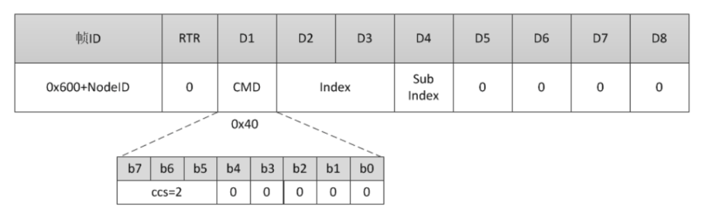
服务器正常响应
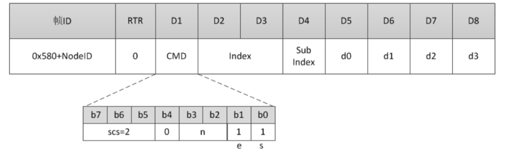
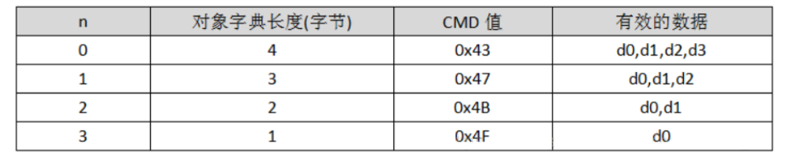
4. SDO upload normal帧格式
客⼾端请求
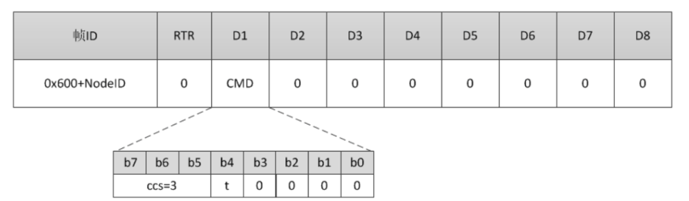
服务器正常响应
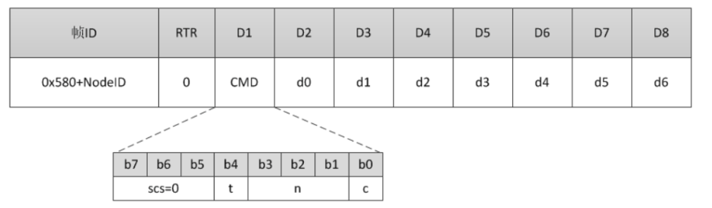
- t:翻转位，每传输⼀次segment翻转⼀次，请求和响应中的t必须相等
- n:代表数据d0~d6中⽆效数据的⻓度，n=0表⽰7个字节数据均有效
- c:等于0表⽰还有更多数据等待传输，等于1表⽰传输完毕

5. 错误响应
当发⽣错误时，服务器返回错误响应
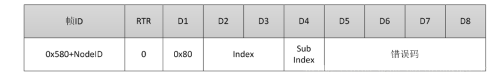
```c
/** definitions used for object dictionary access. ie SDO Abort codes . (See DS 301 v.4.02 p.48)
*/
#define OD_SUCCESSFUL 0x00000000
#define OD_READ_NOT_ALLOWED 0x06010001
#define OD_WRITE_NOT_ALLOWED 0x06010002
#define OD_NO_SUCH_OBJECT 0x06020000
#define OD_NOT_MAPPABLE 0x06040041
#define OD_LENGTH_DATA_INVALID 0x06070010
#define OD_NO_SUCH_SUBINDEX 0x06090011
#define OD_VALUE_TOO_LOW 0x06090031 /* Value range test result */
#define OD_VALUE_TOO_HIGH 0x06090032 /* Value range test result */
/* Others SDO abort codes
*/
#define SDOABT_TOGGLE_NOT_ALTERNED 0x05030000
#define SDOABT_TIMED_OUT 0x05040000
#define SDOABT_OUT_OF_MEMORY 0x05040005 /* Size data exceed SDO_MAX_LENGTH_TRANSFERT */
#define SDOABT_GENERAL_ERROR 0x08000000 /* Error size of SDO message */
#define SDOABT_LOCAL_CTRL_ERROR 0x08000021
```

6. SDO download
当需要写节点中的对象字典的值时，使⽤SDO download协议
当对象字典的⻓度⼩于或等于4个字节时，使⽤SDO download expedited
当对象字典的⻓度⼤于4个字节时，使⽤SDO download normal(segment)

7. SDO download expedited 帧格式
客⼾端发送
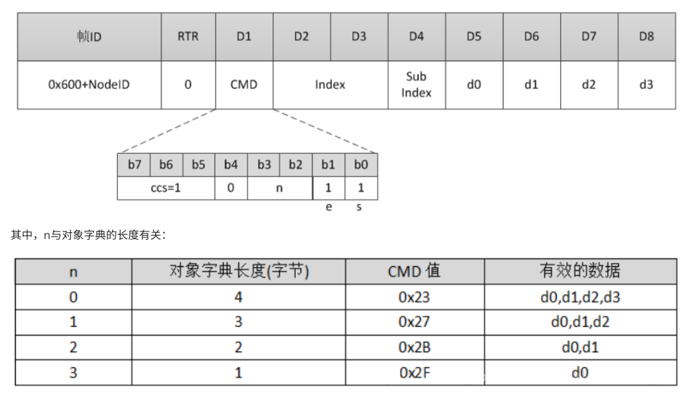
服务器正常响应
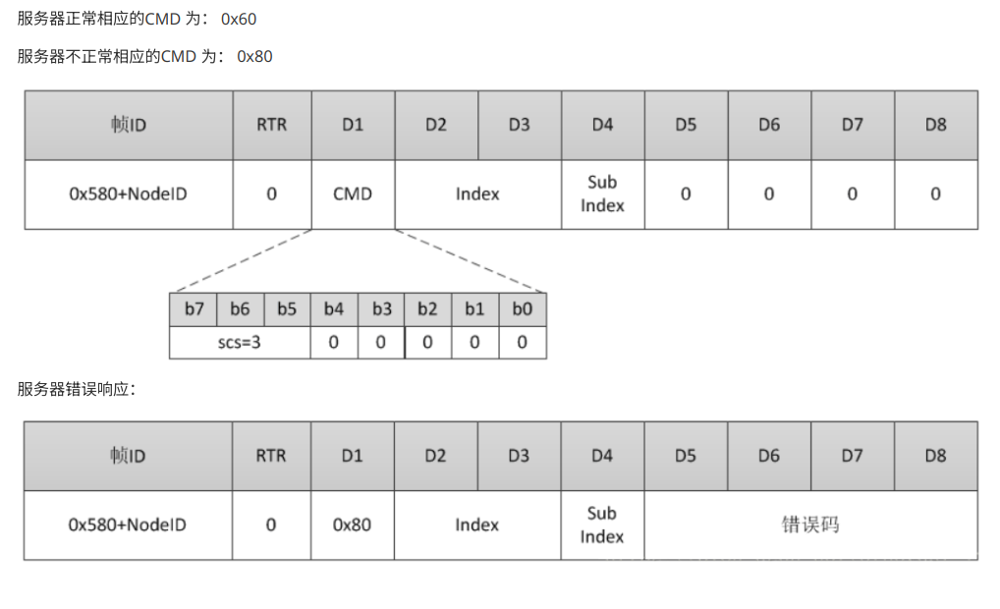

#### 定义⾃⼰设备的通信协议

1. 地址索引范围

   | Index range索引范围 | Description描述                                      |
   | ------------------- | ---------------------------------------------------- |
   | 0000h               | Reserved保留                                         |
   | 0001h to 025Fh      | Data types数据类型                                   |
   | 0260h to 0FFFh      | Reserved保留                                         |
   | 1000h to 1FFFh      | Communication profile area通讯对象⼦协议区           |
   | 2000h to 5FFFh      | Manufacturer-specific profile area制造商特定⼦协议区 |
   | 6000h to 9FFFh      | Standardized profile area标准化设备⼦协议区          |
   | A000h to AFFFh      | Network variables⽹络变量（符合IEC61131-3）          |
   | B000h to BFFFh      | System variables⽤于路由⽹关的系统变量               |
   | C000h to FFFFh      | Reserved保留                                         |

   对象字典索引2000h to 5FFFh为制造商特定⼦协议，通常是存放所应⽤⼦协议的应⽤数据。使⽤地址2000h作为读写的地址。  

2. 写设备协议

   备控制使⽤1个8位的数据即可  

   | Index 索引地址 | 之索引 | 名称  | 控制的位    | 位说明       |
   | -------------- | ------ | ----- | ----------- | ------------ |
   | 0x2000         | 0x1    | LED1  | 0b0000 0001 | 为1开，为0关 |
   | 0x2000         | 0x1    | LED2  | 0b0000 0010 | 为1开，为0关 |
   | 0x2000         | 0x1    | BEEP  | 0b0000 0100 | 为1开，为0关 |
   | 0x2000         | 0x1    | RELAY | 0b0000 1000 | 为1开，为0关 |

   写设备

   ```c
   // 设备发送数据
   // 地址： 0x601
   // DLC ： 8
   // 数据 ： 2f 00 20 01 0f 00 00 00
   // 命令解析:
   // 地址： 0x601 , 这个就是 0x600 + NodeID
   // DLC ： 8 ， 发送字节数
   // 2f : 表示1个字节有效
   // 00 20 : 表示索引地址为2000
   // 01 : 表示字索引为1
   // 0f : 0b0000 1111 , 设备全部工作
   
   
   //设备返回数据
   // CANID : 0x581
   // DLC : 8
   // 数据 : 60 00 20 01 00 00 00 00
   // 命令解析:
   // CANID : 0x581 , 这个就是 0x580 + NodeID
   // DLC : 8 , 接收字节数
   // 60 : 数据正常相应
   // 00 20 : 表示索引地址为2000
   // 01 : 表示字索引为1
   ```

   关闭设备

   ```c
   // 发送命令：
   // 地址： 0x601
   // DLC ： 8
   // 数据 ： 2f 00 20 01 00 00 00 00
   // 设备返回数据：
   // 地址： 0x581
   // DLC ： 8
   // 数据 ： 2f 00 20 01 00 00 00 00
   ```

3. 读传感器协议

   感器数据使⽤1个16位的数据即可 

   | Index 索引地址 | 之索引 | 名称       | 2字节  |
   | -------------- | ------ | ---------- | ------ |
   | 0x2000         | 0x2    | 温度       | uint16 |
   | 0x2000         | 0x3    | 湿度       | uint16 |
   | 0x2000         | 0x4    | 电压       | uint16 |
   | 0x2000         | 0x5    | 电流       | uint16 |
   | 0x2000         | 0x6    | 功率       | uint16 |
   | 0x2000         | 0x7    | 电位器电压 | uint16 |
   | 0x2000         | 0x8    | CPU温度    | uint16 |

   ```
   //读温度传感器数据，从机地址设置为1时 ，使⽤SDO的upload协议通信
   // 发送数据如下：
   // 地址： 0x601
   // DLC ： 8
   // 数据 ： 4b 00 20 02 00 00 00 00
   // 命令解析:
   // 地址： 0x601 , 这个就是 0x600 + NodeID
   // DLC ： 8 ， 发送字节数
   // 4b : 表示2个字节有效
   // 00 20 : 表示索引地址为2000
   // 02 : 表示字索引为2
   
   
   //设备返回数据
   // CANID : 0x581
   // DLC : 8
   // 数据 : 4B 00 20 02 6A 0A 00 00
   // 命令解析:
   // CANID : 0x581 , 这个就是 0x580 + NodeID
   // DLC : 8 , 接收字节数
   // 4b : 表示2个字节有效
   // 00 20 : 表示索引地址为 0x2000
   // 02 : 表示字索引为2
   // 6A 0A : 读回来的数据是 0xA6A
   ```

### 生成二进制文件
```c
fromelf --bin -o "$L@L.bin" "#L
```

