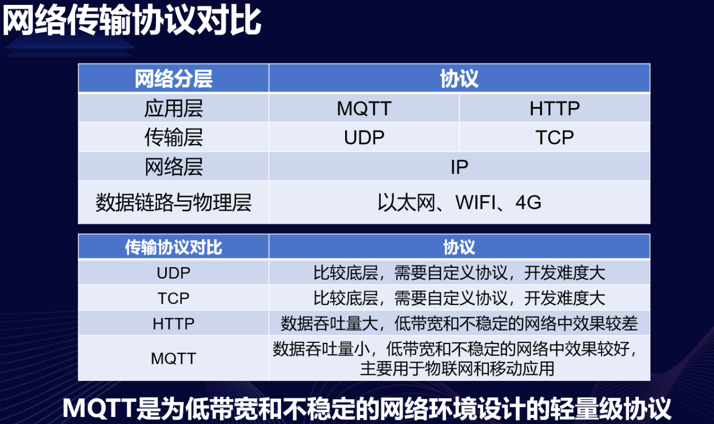
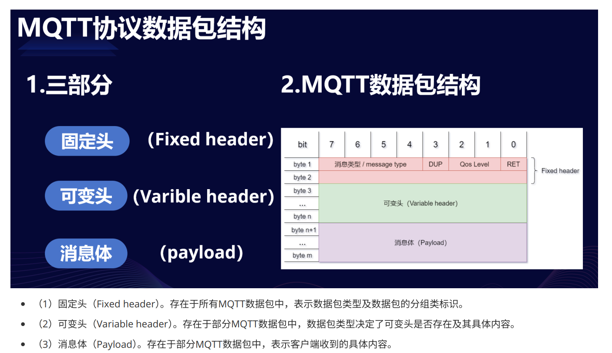
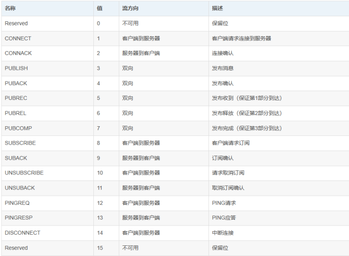
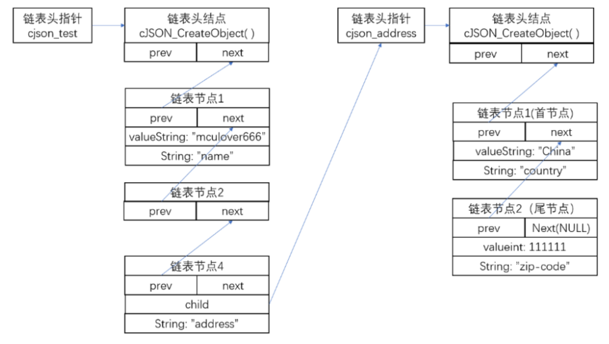

##  MQTT协议

### MQTT简述

#### MQTT（Message Queuing Telemetry Transport，消息队列遥测传输协议），是⼀种基于发布/订阅（publish/subscribe）模式的"轻量级"通讯协议，该协议构建于TCP/IP协议上，由IBM在1999年发布。MQTT最⼤优点在于，可以以极少的代码和有限的带宽，为连接远程设备提供实时可靠的消息服务。作为⼀种低开销、低带宽占⽤的即时通讯协议，使其在物联⽹、⼩型设备、移动应⽤等⽅⾯有较⼴泛的应⽤ 


###  设计规范
- 1.精简，不添加可有可⽆的功能；
- 2.发布/订阅（Pub/Sub）模式，⽅便消息在传感器之间传递；
- 3.允许⽤⼾动态创建主题，零运维成本；
- 4.把传输量降到最低以提⾼传输效率；
- 5.把低带宽、⾼延迟、不稳定的⽹络等因素考虑在内；
- 6.⽀持连续的会话控制；
- 7.理解客⼾端计算能⼒可能很低；
- 8.提供服务质量管理；
- 9.假设数据不可知，不强求传输数据的类型与格式，保持灵活性

### 主要特性
#### 主流的MQTT是基于TCP连接进⾏数据推送的，但是同样有基于UDP的版本，叫做MQTT-SN  
- **⾄多⼀次**: QoS0 通信效率高 会有丢包情况
##### 消息发布完全依赖底层TCP/IP⽹络。会发⽣消息丢失或重复。这⼀级别可⽤于如下情况，环境传感器数据，丢失⼀次读记录⽆所谓，因为不久后还会有第⼆次发送。这⼀种⽅式主要普通APP的推送，倘若你的智能设备在消息推送时未联⽹，推送过去没收到，再次联⽹也就收不到了。

- **⾄少⼀次**: QoS1 通信效率一般 不会丢包 会有重复数据包
##### 确保消息到达，但消息重复可能会发⽣。

- **只有⼀次**: QoS2 通信效率最差 数据最准确
##### 确保消息到达⼀次。在⼀些要求⽐较严格的计费系统中，可以使⽤此级别。在计费系统中，消息重复或丢失会导致不正确的结果。这种最⾼质量的消息发布服务还可以⽤于即时通讯类的APP的推送，确保⽤⼾收到且只会收到⼀次。

- ⼩型传输，开销很⼩（固定⻓度的头部是2字节），协议交换最⼩化，以降低⽹络流量  

### 协议原理

#### 实现MQTT协议需要客⼾端和服务器端通讯完成，在通讯过程中，MQTT协议中有三种⾝份：发布者（Publish）、代理（Broker）（服务器）、订阅者（Subscribe）。其中，消息的发布者和订阅者都是客⼾端，消息代理是服务器，消息发布者可以同时是订阅者

#### MQTT传输的消息分为：主题（Topic）和负载（payload）两部分：
- （1）Topic，可以理解为消息的类型，订阅者订阅（Subscribe）后，就会收到该主题的消息内容（payload）
- （2）payload，可以理解为消息的内容，是指订阅者具体要使⽤的内容

#### MQTT会构建底层⽹络传输：它将建⽴客⼾端到服务器的连接，提供两者之间的⼀个有序的、⽆损的、基于字节流的双向传输 当应⽤数据通过MQTT⽹络发送时，MQTT会把与之相关的服务质量（QoS）和主题名（Topic）相关连
#### 数据包

- 数据包类型 位置：Byte 1中bits 7-4


- 标识位 位置：Byte 1中bits 3-0
在不使⽤标识位的消息类型中，标识位被作为保留位。如果收到⽆效的标志时，接收端必须关闭⽹络连接：
（1）DUP：发布消息的副本。⽤来在保证消息的可靠传输，如果设置为1，则在下⾯的变⻓中增加MessageId，并且需要回复确认，以保证消息传输完成，但不能⽤于检测消息重复发送

（2）QoS：发布消息的服务质量，即：保证消息传递的次数

（3）RETAIN： 发布保留标识，表⽰服务器要保留这次推送的信息，如果有新的订阅者出现，就把这消息推送给它，如果设有那么推送⾄当前订阅者后释放。

- 剩余⻓度（Remaining Length）地址：Byte 2
固定头的第⼆字节⽤来保存变⻓头部和消息体的总⼤⼩的，但不是直接保存的。这⼀字节是可以扩展，其保存机制，前7位⽤于保存⻓度，后⼀部⽤做标识。当最后⼀位为1时，表⽰⻓度不⾜，需要使⽤⼆个字节继续保存

- MQTT可变头
MQTT数据包中包含⼀个可变头，它驻位于固定的头和负载之间。可变头的内容因数据包类型⽽不同，较常的应⽤是作为包的标识：很多类型数据包中都包括⼀个2字节的数据包标识字段，这些类型的包有：PUBLISH (QoS > 0)、PUBACK、PUBREC、PUBREL、PUBCOMP、SUBSCRIBE、SUBACK、UNSUBSCRIBE、UNSUBACK

- Payload消息体
Payload消息体位MQTT数据包的第三部分，包含CONNECT、SUBSCRIBE、SUBACK、UNSUBSCRIBE四种类型的消息：
（1）CONNECT，消息体内容主要是：客⼾端的ClientID、订阅的Topic、Message以及⽤⼾名和密码。
（2）SUBSCRIBE，消息体内容是⼀系列的要订阅的主题以及QoS。
（3）SUBACK，消息体内容是服务器对于SUBSCRIBE所申请的主题及QoS进⾏确认和回复。
（4）UNSUBSCRIBE，消息体内容是要订阅的主题。

### 1. ESP8266的MQTT指令集

#### MQTT指令介绍
```c
AT+MQTTUSERCFG：        //设置 MQTT ⽤⼾属性
AT+MQTTLONGCLIENTID：   //设置 MQTT 客⼾端 ID
AT+MQTTLONGUSERNAME：   //设置 MQTT 登陆⽤⼾名
AT+MQTTLONGPASSWORD：   //设置 MQTT 登陆密码
AT+MQTTCONNCFG：        //设置 MQTT 连接属性
AT+MQTTCONN：           //连接 MQTT Broker
AT+MQTTPUB：            //发布 MQTT 消息（字符串）
AT+MQTTPUBRAW：         //发布 MQTT 消息（⼆进制）
AT+MQTTSUB：            //订阅 MQTT Topic
AT+MQTTUNSUB：          //取消订阅 MQTT Topic
AT+MQTTCLEAN：          //断开 MQTT 连接
```

- 连接MQTT服务器
配置STA模式 配置为⽆线⽹卡模式
```c
AT+CWMODE=1
```
- 连接路由器
```c
AT+CWJAP="afeiya","987654321"
```
- 配置 MQTT 属性
client ID 名字⼀定要⻓， 服务器中发⽣重名后， 服务器会⾃动断开连接
```c
AT+MQTTUSERCFG=0,1,"5718402539345041066CFF36","","",0,0,""
```
- 连接MQTT服务器
```c
AT+MQTTCONN=0,"broker.emqx.io",1883,0
```
- 查询服务器连接状态
```c
AT+MQTTCONN?
```
- 发布主题消息
```c
AT+MQTTPUB=0,"ESP8266/sensor","123456",0,0
```
- 订阅主题消息
```c
AT+MQTTSUB=0,"ESP8266/control",0
```

### 2. JSON字符串

#### JSON -- 轻量级的数据格式	JSON 全称 JavaScript Object Notation，即 JS对象简谱，是⼀种轻量级的数据格式。它采⽤完全独⽴于编程语⾔的⽂本格式来存储和表⽰数据，语法简洁、层次结构清晰，易于⼈阅读和编写，同时也易于机器解析和⽣成，有效的提升了⽹络传输效率

#### JSON的语法规则
##### JSON对象是⼀个⽆序的"名称/值"键值对的集合：
- 以"{“开始，以”}"结束，允许嵌套使⽤；
- 每个名称和值成对出现，名称和值之间使⽤":"分隔；
- 键值对之间⽤","分隔在这些字符前后允许存在⽆意义的空⽩符；
对于键值，可以有如下值：
- ⼀个新的json对象
- 数组：使⽤"[“和”]"表⽰
- 数字：直接表⽰，可以是整数，也可以是浮点数
- 字符串：使⽤引号"表⽰
- 字⾯值：false、null、true中的⼀个(必须是⼩写)
```c
ex:
    {
    "name": "mculover666",
    "age": 22,
    "weight": 55.5,
    "address":
    {
    "country": "China",
    "zip-code": 111111
    },
    "skill": ["c", "Java", "Python"],
    "student": false
    }
```


#### cJSON是⼀个使⽤C语⾔编写的JSON数据解析器，具有超轻便，可移植，单⽂件的特点，使⽤MIT开源协议cJSON的源码⽂件只有两个：
- cJSON.h
- cJSON.c
```c
/* The cJSON structure: */
typedef struct cJSON
{
    /* next/prev allow you to walk array/object chains. Alternatively, use
    GetArraySize/GetArrayItem/GetObjectItem */
    struct cJSON *next;
    struct cJSON *prev;
    /* An array or object item will have a child pointer pointing to a chain of the items in the
    array/object. */
    struct cJSON *child;
    /* The type of the item, as above. */
    int type;
    /* The item's string, if type==cJSON_String and type == cJSON_Raw */
    char *valuestring;
    /* writing to valueint is DEPRECATED, use cJSON_SetNumberValue instead */
    int valueint;
    /* The item's number, if type==cJSON_Number */
    double valuedouble;
    /* The item's name string, if this item is the child of, or is in the list of subitems of an object. */
    char *string;
} cJSON;
```
#### cJSON的设计很巧妙 ⾸先，它不是将⼀整段JSON数据抽象出来，⽽是将其中的⼀条JSON数据抽象出来，也就是⼀个键值对，⽤上⾯的结构体 strcut cJSON 来表⽰，其中⽤来存放值的成员列表如下：
- String：⽤于表⽰该键值对的名称；
- type：⽤于表⽰该键值对中值的类型；
- valuestring：如果键值类型(type)是字符串，则将该指针指向键值；
- valueint：如果键值类型(type)是整数，则将该指针指向键值；
- valuedouble：如果键值类型(type)是浮点数，则将该指针指向键值；
#### 其次，⼀段完整的JSON数据中由很多键值对组成，并且涉及到键值对的查找、删除、添加，所以使⽤链表来存储整段JSON数据，如上⾯的代码所⽰：
- next指针：指向下⼀个键值对
- prev指针: 指向上⼀个键值对
#### 最后，因为JSON数据⽀持嵌套，所以⼀个键值对的值会是⼀个新的JSON数据对象（⼀条新的链表），也有可能是⼀个数组，⽅便起⻅，在cJSON中，数组也表⽰为⼀个数组对象，⽤链表存储，所以：在键值对结构体中，当该键值对的值是⼀个嵌套的JSON数据或者⼀个数组时，由child指针指向该条新链表

#### JSON数据解析 解析⽅法 解析JSON数据的过程，其实就是剥离⼀个⼀个链表节点(键值对)的过程
- 创建链表头指针
```c
cJSON* cjson_test = NULL;
```
- 解析整段JSON数据，并将链表头结点地址返回，赋值给头指针。解析整段数据使⽤的API只有⼀个
```c
(cJSON *) cJSON_Parse(const char *value);
```
- 根据键值对的名称从链表中取出对应的值，返回该键值对(链表节点)的地址
```c
(cJSON *) cJSON_GetObjectItem(const cJSON * const object, const char * const string);
```
- 如果JSON数据的值是数组，使⽤下⾯的两个API提取数据
```c
(int) cJSON_GetArraySize(const cJSON *array);
(cJSON *) cJSON_GetArrayItem(const cJSON *array, int index);
```
```c
ex:
#include <stdio.h>
#include "cJSON.h"
    char *message =
    "{ \
    \"name\":\"mculover666\", \
    \"age\": 22, \
    \"weight\": 55.5, \
    \"address\": \
    { \
        \"country\": \"China\",\
        \"zip-code\": 111111\
    }, \
    \"skill\": [\"c\", \"Java\", \"Python\"],\
    \"student\": false \
    }";
int main(void)
{
    cJSON* cjson_test = NULL;
    cJSON* cjson_name = NULL;
    cJSON* cjson_age = NULL;
    cJSON* cjson_weight = NULL;
    cJSON* cjson_address = NULL;
    cJSON* cjson_address_country = NULL;
    cJSON* cjson_address_zipcode = NULL;
    cJSON* cjson_skill = NULL;
    cJSON* cjson_student = NULL;
    int skill_array_size = 0, i = 0;
    cJSON* cjson_skill_item = NULL;
    /* 解析整段JSO数据 */
    cjson_test = cJSON_Parse(message);
    if(cjson_test == NULL)
    {
        printf("parse fail.\n");
        return -1;
    } 
    //在实际使⽤时，如果提前不确定数据类型，应该先判断type的值，确定数据类型，再从对应的数据域中提取数据
    /* 依次根据名称提取JSON数据（键值对） */
    cjson_name = cJSON_GetObjectItem(cjson_test, "name");
    cjson_age = cJSON_GetObjectItem(cjson_test, "age");
    cjson_weight = cJSON_GetObjectItem(cjson_test, "weight");
    printf("name: %s\n", cjson_name->valuestring);
    printf("age:%d\n", cjson_age->valueint);
    printf("weight:%.1f\n", cjson_weight->valuedouble);
    /* 解析嵌套json数据 */
    cjson_address = cJSON_GetObjectItem(cjson_test, "address");
    cjson_address_country = cJSON_GetObjectItem(cjson_address, "country");
    cjson_address_zipcode = cJSON_GetObjectItem(cjson_address, "zip-code");
    printf("address-country:%s\naddress-zipcode:%d\n", cjson_address_country->valuestring,
    cjson_address_zipcode->valueint);
    /* 解析数组 */
    cjson_skill = cJSON_GetObjectItem(cjson_test, "skill");
    skill_array_size = cJSON_GetArraySize(cjson_skill);
    printf("skill:[");
    for(i = 0; i < skill_array_size; i++)
    {
        cjson_skill_item = cJSON_GetArrayItem(cjson_skill, i);
        printf("%s,", cjson_skill_item->valuestring);
    } 
    printf("\b]\n");
    /* 解析布尔型数据 */
    cjson_student = cJSON_GetObjectItem(cjson_test, "student");
    if(cjson_student->valueint == 0)
    {
        printf("student: false\n");
    } 
    else
    {
        printf("student:error\n");
    } 
    return 0;
}
```
#### cJSON使⽤过程中的内存问题 内存及时释放cJSON的所有操作都是基于链表的，所以cJSON在使⽤过程中⼤量的使⽤malloc从堆中分配动态内存的，所以在使⽤完之后，应当及时调⽤下⾯的函数，清空cJSON指针所指向的内存，该函数也可⽤于删除某⼀条数据
```c
(void) cJSON_Delete(cJSON *item);
```
- 注意：该函数删除⼀条JSON数据时，如果有嵌套，会连带删除

#### 内存钩⼦ cJSON在⽀持⾃定义malloc函数和free函数
- 使⽤cJSON_Hooks来连接⾃定义malloc函数和free函数
```c
typedef struct cJSON_Hooks
{
    /* malloc/free are CDECL on Windows regardless of the default calling convention of the compiler,
    so ensure the hooks allow passing those functions directly. */
    void *(CJSON_CDECL *malloc_fn)(size_t sz);
    void (CJSON_CDECL *free_fn)(void *ptr);
} cJSON_Hooks;
```
- 初始化钩⼦cJSON_Hooks
```c
(void) cJSON_InitHooks(cJSON_Hooks* hooks);
```

### 设计自己的通信协议
1. 控制设备的json字符串
```c
"device": // 可以带 可以不带
{
    "LED1":true,
    "LED2":true,
    "BEEP":true,
    "RELAY":true
}
```
2. 传感器数据上传的json字符串
```c
{
    "TP":25.5, // ℃
    "RH":45.5, // %
    "CU":201, // ma
    "VL":4.85, // V
    "PW":809, // mW
    "VR":3.0, // V
    "CPU":33.2 // ℃
} 
// TP : 温度 类型为 实数
// RH : 湿度 类型为 实数
// CU : 电流 类型为 整数
// VL : 电压 类型为 实数
// PW : 功率 类型为 整数
// VR : 电位器电压 类型为 实数
// CPU : CPU温度 类型为 实数
```
3. 主题设置
- STM32的发送或上⾏主题为
```c
STM32/UpLoad/cpuid
// 例如
STM32/UpLoad/5718402539345041066CFF36
```
- STM32的接收或下⾏送主题为
```c
STM32/DownLoad/cpuid
// 例如
STM32/DownLoad/5718402539345041066CFF36
```
